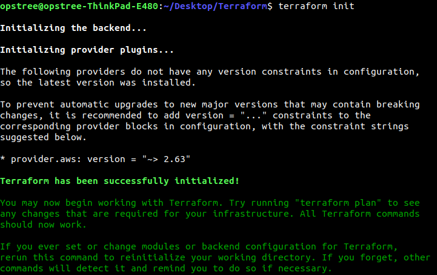
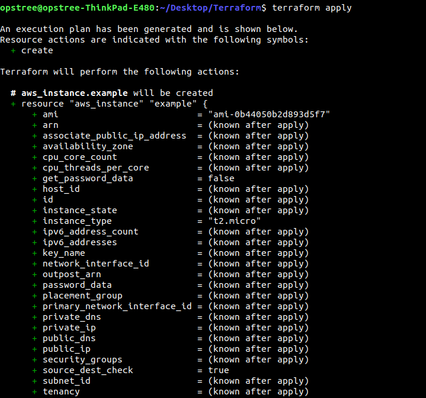
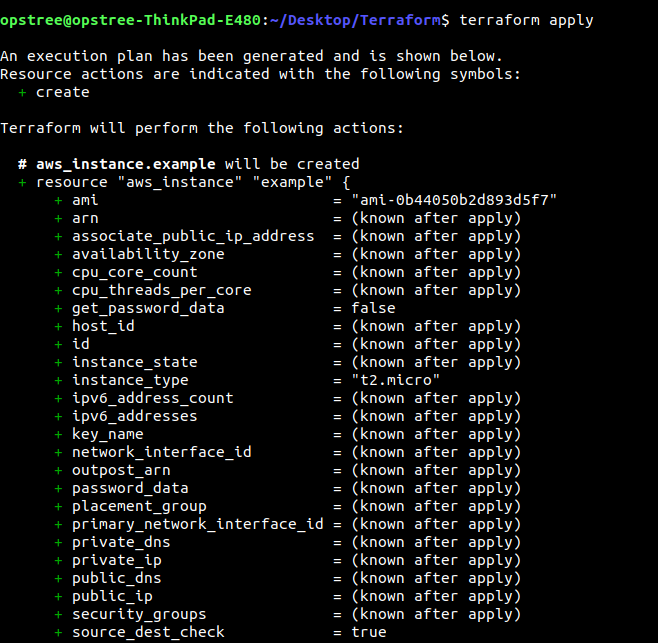
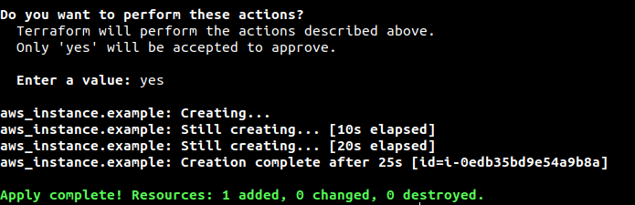

### Deploy a single server ###
Terraform code is written in a language called **HCL** in files with the extension .tf. It is a declarative language, so our goal is to describe the infrastructure we want, and Terraform will figure out how to create it.
Terraform can create infrastructure across a wide variety of platforms, or what it calls providers, including AWS, Azure, Google Cloud, DigitalOcean and many others.

The first step to using Terraform is typically to configure the providers you want to use.
Create a file called **main.tf** and put the code:

    provider "aws" {
      region = "ap-south-1"
      access_key = "******************"
      secret_key = "**********************************"
    }
This tells Terraform that you are going to be using the AWS provider and that to deploy your infrastructure in the ```ap-south-1``` along with ```access key``` & ```secret key```.
Add the following code to your ```main.tf```, which uses the ***aws_instance_resource*** to deploy an EC2 Instance:
    
    resource "aws_instance" "myName" {
      ami           = "ami-0b44050b2d893d5f7"
      instance_type = "t2.micro"
      
      tags = {
        Name = "terraform-instance"
      }
    }
    
The general synatax for a Terraform resource is:

    resource "<PROVIDER>_<TYPE>" "<NAME>" {
     [CONFIG …]
    }
    
 ***PROVIDER-*** It is the name service provider in our case AWS is provider.
 
 ***TYPE-*** It is just tyoe of resources to create in that provider (e.g. instance).
 
 ***NAME-*** It is an identifier you can use throughout the Terraform code to refer to this resource (e.g. myName)
 
 ***CONFIG-*** It consists of one or more arguments that are specific to that resource (e.g. ```ami = ami-0b44050b2d893d5f7```)
 
 Now in the terminal, go into the folder where is you created ```main.tf``` and run the command ```terraform init```
 
 
 
 ### But why ```terraform init``` ###
 The ```terraform``` binary contains the basic functionality for Terraform, but it does not come with the code for any of the providers (e.g. AWS, Azure, GCP etc), so when first starting to use Terraform, you need to run ```terraform init``` to tell Terraform to scan the code, figure our the what providers you're using, and download the code for them.
 By default the provider code will be downloaded into a ```.terraform``` folder.
 Be aware that you need to to run ```init``` any time you start with new Terraform code, and no worry it is safe to run multiple times (the command is idempotent).
 
 Now that if you have the provider code downloaded, run the ```terraform plan``` command.
 
 

The ```plan``` command lets you see what Terraform will do before actually doing it.
```(+)``` are going to created 
```(-)``` are going to delete something
```(~)``` are going to modified in-place.

To actually create instance, run the ```terraform apply``` command

 
 
 Type ***yes*** and hit enter to deploy EC2 instance.
 
  
  
 You SET THE BAR! you have deployed a server with Terraform.
